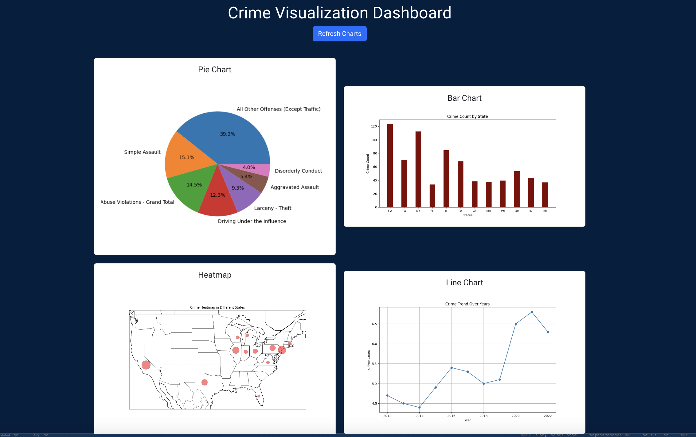

# Crime Visualization Dashboard



## Prerequisites

- Python 3.10
- Docker

## Setup

### MongoDB Setup

1. Pull the latest MongoDB Docker image:

    ```sh
    docker pull mongo:latest
    ```

2. Run MongoDB in a Docker container:

    ```sh
    docker run -d -p 27017:27017 --name mongodb mongo:latest
    ```

### Backend Setup

1. Install a virtual environment:

    ```sh
    python3 -m venv venv
    ```

2. Activate the virtual environment:

    ```sh
    source venv/bin/activate
    ```

3. Install the required Python packages:

    ```sh
    pip install -r requirements.txt
    ```

3. Run the database script (do this only once):

    ```sh
    python backend/database.py
    ```

3. Run the flask backend:

    ```sh
    cd backend
    python app.py
    ```

### Frontend Setup

2. Navigate to frontend:

    ```sh
    cd frontend
    ```

3. Install dependencies:

    ```sh
    npm install
    ```

3. Start the React App:

    ```sh
    npm start
    ```    

    

### Running the Application Docker (optional)

1. Build and run the Docker containers:

    ```sh
    docker-compose up --build
    ```
    
2. Access the React frontend at [http://localhost:3000](http://localhost:3000).

3. Access the Flask API endpoints at [http://localhost:5000](http://localhost:5000).

### Running Tests

1. Go to the `tests` directory:

    ```sh
    cd tests
    ```

2. Run the tests using pytest:

    ```sh
    pytest
    ```

## Notes

- Make sure to have Python 3.10 installed.
- MongoDB should be running before starting the backend.
- The database script (`backend/database.py`) should be run once to initialize the database.


